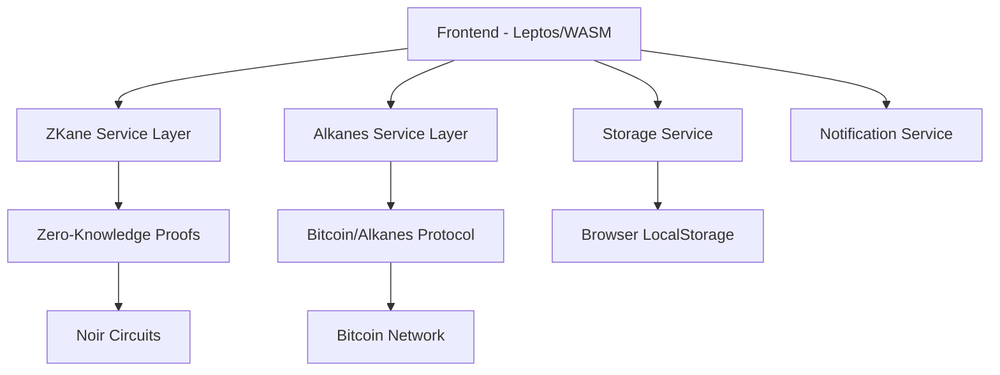

# ZKane System Patterns

## Architecture Overview
ZKane is a privacy-preserving web application built with a modern Rust-based stack:



## Key Design Patterns

### Component Architecture
- **Leptos Components**: Reactive UI components with signal-based state management
- **Service Layer**: Abstracted business logic for ZKane, Alkanes, Storage, and Notifications
- **Context Providers**: Global state management for user preferences, app config, and services

### State Management
- **Signals**: Reactive state with `create_signal()` for local component state
- **Context**: Global state sharing via `provide_context()` and `expect_context()`
- **Resources**: Async data fetching with `Resource::new()` for external API calls

### Privacy-First Design
- **Client-Side Only**: No server dependencies, all processing in browser
- **Local Storage**: Sensitive data (deposit notes) stored securely in browser
- **Zero-Knowledge Proofs**: Cryptographic privacy guarantees via Noir circuits

## Current UI Patterns

### Theme System
- CSS Variables for consistent theming
- Light/Dark/Auto theme support
- System preference detection
- Persistent user preferences

### Navigation Structure
- Header with brand, navigation, and actions
- Main content area with routing
- Footer with links and information

### Component Hierarchy
```
App
├── Header (Brand, Navigation, Actions)
├── NotificationContainer
├── Main Content (Routed Pages)
│   ├── HomePage (Hero, Features, Stats)
│   ├── DepositPage
│   ├── WithdrawPage
│   ├── PoolsPage
│   ├── HistoryPage
│   ├── SettingsPage
│   ├── HelpPage
│   └── AboutPage
└── Footer
```

## Technical Constraints
- **WebAssembly**: Rust code compiled to WASM for browser execution
- **No Backend**: Fully client-side application
- **Browser Compatibility**: Modern browsers with WASM support
- **Performance**: Optimized for cryptographic operations in browser